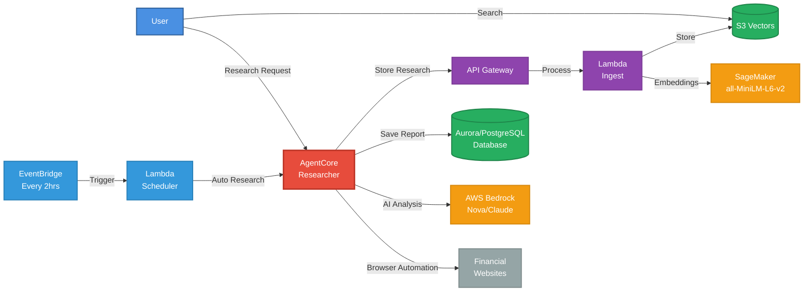

# Guide 4: AgentCore Researcher - Testing, Deployment & Operations

This guide covers the AgentCore-based researcher agent located in `backend/agent_researcher`. This is an alternative implementation that uses browser automation to research financial topics and integrates directly with the database system.

## 📋 Prerequisites

Before starting, ensure you have:
1. **Infrastructure Setup**: Complete guides 1-3 (permissions, SageMaker, ingestion)
2. **Database**: Complete guide 5 (Aurora/PostgreSQL database with test data)
3. **AWS CLI**: Configured with your credentials
4. **Browser Dependencies**: AgentCore Browser tool for web automation
5. **Environment Variables**: All required SSM parameters configured

## What You'll Deploy

The AgentCore Researcher is a Python-based agent that:
- Uses AWS Bedrock with Claude/Nova models for AI capabilities
- Employs AgentCore Browser tool for web automation and scraping
- Integrates directly with Aurora/PostgreSQL database
- Automatically saves research reports to the job system
- Provides comprehensive error handling and timeout protection
- Supports both specific topic research and auto-discovery

Here's how it fits into the Alex architecture:



## 🧪 Local Testing

### Setup Environment

Navigate to the agent folder:

```bash
cd backend/agent_researcher
```

Install browser dependencies:

```bash
# Install Python dependencies (includes AgentCore Browser tool)
uv sync

# No additional browser installation needed - AgentCore Browser is included
```

Verify environment variables are loaded:
```bash
# The agent automatically loads from SSM parameters
# You should see this output when running tests:
# ✅ Loaded environment variables from SSM
```

### Simple Test (Database Integration)

Run the comprehensive database integration test:

```bash
uv run test_simple.py
```

This test performs a complete workflow:
- ✅ **Creates test job**: Inserts a new job record in the database
- ✅ **Runs researcher agent**: Executes Tesla stock analysis with browser automation
- ✅ **Gathers data**: Uses AgentCore Browser tool to visit financial websites
- ✅ **AI analysis**: Processes data with Bedrock models
- ✅ **Saves report**: Stores research in `report_payload` field
- ✅ **Verifies record**: Confirms database save was successful
- ✅ **Cleanup**: Deletes test job to maintain clean state
- ✅ **Proper termination**: Exits with appropriate status codes

Expected successful output:
```
🚀 Starting Researcher Agent Tests
============================================================
🔍 Testing Researcher Agent with Database Integration...
🎯 Using AURORA backend
✅ Created test job: cbb019d1-d1ed-43eb-bdea-2f1783e3ff55
📊 Research Topic: Tesla Stock Analysis
🌐 Using model: us.amazon.nova-pro-v1:0
🌍 Using region: us-west-2

🔍 Running Researcher Agent...
📊 Research completed, result length: 763 characters
✅ Saved research report to database
✅ Verified report saved in database
   Report content length: 763
   Topic: Tesla Stock Analysis
   Agent: researcher
   Generated at: 2025-10-27T01:47:23.152101
   Content snippet: Based on typical data points for Tesla's stock...
✅ Researcher Agent generated substantial output
✅ Response appears to be about the requested topic
✅ Deleted test job: cbb019d1-d1ed-43eb-bdea-2f1783e3ff55

============================================================
✅ All tests completed successfully!
```

### Manual Research Execution

Run the researcher agent directly with specific topics:

```bash
# Research a specific company
python3 -c "
from agent import create_agent_and_run
result = create_agent_and_run('Apple Stock Analysis')
print('Research Result:')
print('=' * 50)
print(result)
print('=' * 50)
"

# Research a market sector
python3 -c "
from agent import create_agent_and_run
result = create_agent_and_run('Technology Sector Analysis')
print(result)
"

# Auto topic discovery (agent finds trending topics)
python3 -c "
from agent import create_agent_and_run
result = create_agent_and_run()  # No topic provided
print('Auto-discovered topic research:')
print(result)
"
```

### Integration with Job System

Test the full database integration workflow:

```python
# Example: Create and process research job
import sys
import os
sys.path.append(os.path.join(os.path.dirname(__file__), '..', 'database'))

from src.models import Database
from src.schemas import JobCreate

# Initialize database
db = Database()

# Create research job
job = JobCreate(
    clerk_user_id="test_user_001",
    job_type="instrument_research",
    request_payload={"topic": "NVIDIA Stock Analysis", "urgency": "high"}
)
job_id = db.jobs.create(job.model_dump())
print(f"Created research job: {job_id}")

# Manually trigger research (in production this would be automated)
from agent import create_agent_and_run
result = create_agent_and_run("NVIDIA Stock Analysis")

# Update job with results
report_payload = {
    "content": result,
    "topic": "NVIDIA Stock Analysis",
    "agent": "researcher",
    "generated_at": "2025-10-27T10:30:00"
}
db.jobs.update_report(job_id, report_payload)

# Verify results
saved_job = db.jobs.find_by_id(job_id)
print(f"Job status: {saved_job.get('status')}")
print(f"Report length: {len(saved_job.get('report_payload', {}).get('content', ''))}")

# Cleanup
db.jobs.delete(job_id)
print(f"Deleted job: {job_id}")
```

## 🔧 Configuration

### Environment Variables

The agent automatically loads these SSM parameters:

**Required for Database:**
- `/alex/env/AURORA_CLUSTER_ARN` - Aurora cluster ARN (if using Aurora)
- `/alex/env/AURORA_SECRET_ARN` - Database credentials secret (if using Aurora)
- `/alex/env/SQLALCHEMY_DATABASE_URI` - PostgreSQL connection (if using PostgreSQL)
- `/alex/env/DB_BACKEND` - Database backend: 'aurora' or 'postgres'

**Required for AI:**
- `/alex/env/BEDROCK_MODEL_ID` - AI model ID (e.g., 'us.amazon.nova-pro-v1:0')
- `/alex/env/BEDROCK_REGION` - AWS region for Bedrock (e.g., 'us-west-2')

**Required for Document Ingestion:**
- `/alex/env/ALEX_API_ENDPOINT` - API endpoint for document ingestion
- `/alex/env/ALEX_API_KEY` - API key for ingestion service

**Optional:**
- `/alex/env/AURORA_DATABASE` - Database name (defaults to 'alex')
- `/alex/env/DEFAULT_AWS_REGION` - Default AWS region

### Agent Configuration

The researcher can be configured for different research modes:

```python
# agent.py configuration options

# Browser timeout settings
BROWSER_TIMEOUT = 30000  # 30 seconds per page load
NAVIGATION_TIMEOUT = 60000  # 60 seconds for complex navigation

# Research scope
DEFAULT_RESEARCH_TOPICS = [
    "market trends",
    "earnings reports", 
    "economic indicators",
    "sector analysis"
]

# Website targets for research
FINANCIAL_WEBSITES = [
    "https://finance.yahoo.com",
    "https://www.marketwatch.com",
    "https://www.bloomberg.com"
]
```

### Model Selection

Recommended models for different use cases:

**Cost-Effective:**
```bash
# Amazon Nova Pro (US regions)
BEDROCK_MODEL_ID=us.amazon.nova-pro-v1:0
BEDROCK_REGION=us-east-1
```

**High-Quality Analysis:**
```bash
# Claude Sonnet (multiple regions)
BEDROCK_MODEL_ID=anthropic.claude-3-5-sonnet-20241022-v2:0
BEDROCK_REGION=us-west-2
```

**Open Source:**
```bash
# OpenAI OSS (US West only)
BEDROCK_MODEL_ID=openai.gpt-oss-120b-1:0
BEDROCK_REGION=us-west-2
```

## 🚀 Deployment Options

### Option 1: Lambda Deployment

Deploy as AWS Lambda function for serverless execution:

```bash
cd terraform/4_researcher
```

Update `terraform.tfvars`:
```hcl
# Agent configuration
agent_type = "agentcore"
agent_source_dir = "../../backend/agent_researcher"
runtime = "python3.12"
memory_size = 1024
timeout = 300

# Environment
aws_region = "us-east-1"
bedrock_model_id = "us.amazon.nova-pro-v1:0"
bedrock_region = "us-west-2"
```

Deploy:
```bash
terraform init
terraform plan
terraform apply
```

### Option 2: Container Deployment

Package as Docker container for ECS/Fargate:

```dockerfile
# Dockerfile for agent_researcher
FROM public.ecr.aws/lambda/python:3.12

# Install system dependencies
RUN dnf install -y wget gnupg

# Install Python dependencies (includes AgentCore Browser)
COPY requirements.txt .
RUN pip install -r requirements.txt

# Copy agent code
COPY . .

# Set entrypoint
CMD ["agent.lambda_handler"]
```

Build and deploy:
```bash
# Build container
docker build -t alex-researcher-agent .

# Push to ECR
aws ecr get-login-password --region us-east-1 | docker login --username AWS --password-stdin $AWS_ACCOUNT_ID.dkr.ecr.us-east-1.amazonaws.com
docker tag alex-researcher-agent:latest $AWS_ACCOUNT_ID.dkr.ecr.us-east-1.amazonaws.com/alex-researcher-agent:latest
docker push $AWS_ACCOUNT_ID.dkr.ecr.us-east-1.amazonaws.com/alex-researcher-agent:latest
```

### Option 3: Local Cron Job

Set up scheduled local execution:

```bash
# Add to crontab for automated research
crontab -e

# Add this line for research every 2 hours
0 */2 * * * cd /path/to/alex/backend/agent_researcher && /usr/local/bin/uv run -c "from agent import create_agent_and_run; create_agent_and_run()" >> /tmp/alex-research.log 2>&1
```

## 📊 Monitoring & Operations

### CloudWatch Integration

For Lambda deployment, monitor these metrics:

```bash
# View execution logs
aws logs tail /aws/lambda/alex-researcher-agent --follow

# Check error rates
aws cloudwatch get-metric-statistics \
  --namespace AWS/Lambda \
  --metric-name Errors \
  --dimensions Name=FunctionName,Value=alex-researcher-agent \
  --start-time 2025-10-27T00:00:00Z \
  --end-time 2025-10-27T23:59:59Z \
  --period 3600 \
  --statistics Sum
```

### Key Performance Indicators

Monitor these metrics for optimal performance:

**Execution Metrics:**
- **Duration**: Typical range 60-180 seconds
- **Memory Usage**: Peak around 512MB with browser
- **Success Rate**: Target >95% completion rate
- **Research Quality**: Content length >500 characters

**Error Patterns:**
- **Browser Timeouts**: Websites blocking automation
- **Model Limits**: Rate limiting or quota exceeded
- **Database Errors**: Connection or permission issues
- **Network Issues**: Website unavailability

### Health Checks

Create monitoring scripts:

```python
# health_check.py
import sys
sys.path.append('../database')
from src.models import Database
from agent import create_agent_and_run

def health_check():
    """Verify agent and database connectivity"""
    try:
        # Test database connection
        db = Database()
        test_query = db.client.query("SELECT 1 as test")
        assert test_query[0]['test'] == 1
        print("✅ Database connection: OK")
        
        # Test AI model access
        result = create_agent_and_run("Health check test")
        assert len(result) > 10
        print("✅ AI model access: OK")
        
        # Test browser automation
        assert "test" in result.lower()
        print("✅ Browser automation: OK")
        
        return True
    except Exception as e:
        print(f"❌ Health check failed: {e}")
        return False

if __name__ == "__main__":
    success = health_check()
    sys.exit(0 if success else 1)
```

Run health checks:
```bash
uv run health_check.py
```

## 🐛 Troubleshooting

### Common Issues

**1. Browser Automation Failures**
```
Tool #X: browser
TimeoutError: Navigation timeout
```
**Solution:**
- Websites may be slow or blocking automation
- Agent provides fallback analysis with typical market data
- Consider rotating User-Agent headers or using proxy services

**2. Database Connection Issues**
```
Failed to create test job: Foreign key violation
Key (clerk_user_id)=(test_user_001) is not present in table "users"
```
**Solution:**
```bash
# Create test user in database
cd ../database
uv run reset_db.py --with-test-data
```

**3. Model Access Denied**
```
AccessDeniedException: User is not authorized to perform: bedrock:InvokeModel
```
**Solution:**
- Verify Bedrock model access in AWS console
- Check IAM permissions include `bedrock:InvokeModel`
- Ensure model is available in the specified region

**4. Import Resolution Errors**
```
Import "src.client" could not be resolved
```
**Solution:**
- The test script automatically handles path resolution
- Ensure running from `backend/agent_researcher` directory
- Verify database module exists in `../database/src/`

**5. Process Hanging**
```
Agent execution never completes
```
**Solution:**
- Agent includes 5-minute timeout protection
- Browser processes auto-cleanup on completion
- Use system timeout for additional protection:
```bash
timeout 600 uv run test_simple.py  # 10-minute limit
```

### Performance Optimization

**Reduce Research Time:**
```python
# Optimize browser settings in agent.py
browser_config = {
    "headless": True,
    "args": [
        "--no-sandbox",
        "--disable-dev-shm-usage",
        "--disable-images",
        "--disable-javascript"  # For faster loading
    ]
}
```

**Improve Research Quality:**
```python
# Enhanced prompting in agent.py
research_prompt = """
Analyze the following financial data for {topic}:
1. Current stock price and daily change
2. Key financial metrics (P/E, market cap)
3. Recent news and developments
4. Technical analysis indicators
5. Investment recommendation with reasoning

Provide a concise but comprehensive analysis.
"""
```

**Scale for High Volume:**
- Use connection pooling for database access
- Implement caching for frequently researched topics
- Add rate limiting for external website requests
- Use async/await for concurrent research tasks

### Debug Mode

Enable detailed logging:

```python
# Add to agent.py for debugging
import logging
logging.basicConfig(level=logging.DEBUG)

# Enable browser debugging
browser_context = browser.new_context(
    record_video_dir="./debug_videos",
    record_har_path="./debug_requests.har"
)
```

Run with debug output:
```bash
PYTHONPATH=../database uv run test_simple.py 2>&1 | tee debug.log
```

## 🔄 Research Workflows

### Automated Research Pipeline

1. **Job Creation**: System or user creates research job
2. **Topic Processing**: Agent analyzes research request
3. **Web Research**: Browser automation gathers data
4. **AI Analysis**: Bedrock processes information
5. **Report Generation**: Structured analysis created
6. **Database Storage**: Results saved to job system
7. **Document Ingestion**: Optional vector store update
8. **User Notification**: Results available for review

### Research Topics Supported

**Individual Stocks:**
- "Tesla Stock Analysis"
- "Apple Earnings Review"
- "NVIDIA Growth Prospects"

**Market Sectors:**
- "Technology Sector Overview"
- "Healthcare Investment Trends"
- "Energy Sector Performance"

**Economic Indicators:**
- "Federal Reserve Policy Impact"
- "Inflation Effects on Markets"
- "Employment Data Analysis"

**Market Trends:**
- "AI Stock Performance"
- "ESG Investment Trends"
- "Crypto Market Analysis"

### Custom Research Requests

```python
# Example: Comprehensive research request
research_request = {
    "topic": "Renewable Energy Stocks",
    "focus_areas": [
        "Solar energy companies",
        "Wind power investments", 
        "Battery technology stocks",
        "Government policy impact"
    ],
    "analysis_depth": "comprehensive",
    "include_charts": True,
    "time_horizon": "12 months"
}

result = create_agent_and_run(research_request["topic"])
```

## 📈 Production Considerations

### Scaling Guidelines

**Low Volume (< 10 requests/day):**
- Local execution with cron scheduling
- Single Lambda function deployment
- Basic error handling and logging

**Medium Volume (10-100 requests/day):**
- Lambda with SQS queue for reliability
- CloudWatch monitoring and alerting
- Database connection pooling
- Rate limiting for external APIs

**High Volume (> 100 requests/day):**
- ECS/Fargate with auto-scaling
- Redis caching for common research
- Load balancing across multiple regions
- Advanced error recovery and retry logic

### Security Best Practices

**Network Security:**
```python
# Use VPC endpoints for AWS services
# Restrict outbound internet access
# Rotate API keys regularly
```

**Data Protection:**
```python
# Encrypt sensitive research data
# Implement access logging
# Use least-privilege IAM policies
```

**Browser Security:**
```python
# Run browser in sandbox mode
# Disable unnecessary browser features
# Use temporary profiles for each session
```

## 🎯 Next Steps

After successful AgentCore researcher deployment:

1. **Multi-Agent Integration**: Connect with other agents (reporter, charter, planner)
2. **Advanced Scheduling**: Implement intelligent research timing
3. **Quality Metrics**: Track and improve research accuracy
4. **User Feedback**: Collect and incorporate user preferences
5. **Performance Optimization**: Fine-tune for speed and cost
6. **Continue to Database Setup**: Proceed to [5_database.md](5_database.md)

The AgentCore researcher provides a solid foundation for automated financial research with direct database integration and comprehensive error handling.
