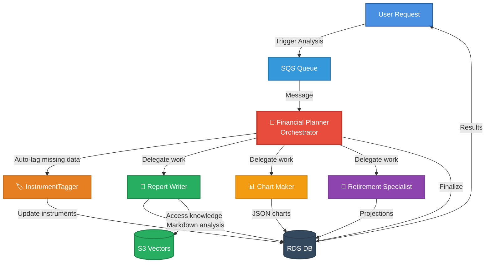

```mermaid
graph TB
    User[User Request] -->|Trigger Analysis| SQS[SQS Queue]
    SQS -->|Message| Planner[🎯 Financial Planner<br/>Orchestrator]
    
    Planner -->|Auto-tag missing data| Tagger[🏷️ InstrumentTagger]
    Tagger -->|Update instruments| DB[(RDS DB)]
    
    Planner -->|Delegate work| Reporter[📝 Report Writer]
    Planner -->|Delegate work| Charter[📊 Chart Maker]
    Planner -->|Delegate work| Retirement[🎯 Retirement Specialist]
    
    Reporter -->|Markdown analysis| DB
    Charter -->|JSON charts| DB
    Retirement -->|Projections| DB
    
    Reporter -->|Access knowledge| S3V[(S3 Vectors)]
    
    Planner -->|Finalize| DB
    DB -->|Results| User
    
    %% User & Interface
    style User fill:#4A90E2,stroke:#2E5F99,stroke-width:2px,color:#ffffff
    
    %% Orchestrator (Central Command)
    style Planner fill:#E74C3C,stroke:#C0392B,stroke-width:3px,color:#ffffff
    
    %% Specialized AI Agents
    style Reporter fill:#27AE60,stroke:#1E8449,stroke-width:2px,color:#ffffff
    style Charter fill:#F39C12,stroke:#D68910,stroke-width:2px,color:#ffffff
    style Retirement fill:#8E44AD,stroke:#7D3C98,stroke-width:2px,color:#ffffff
    style Tagger fill:#E67E22,stroke:#CA6F1E,stroke-width:2px,color:#ffffff
    
    %% Infrastructure & Data
    style SQS fill:#3498DB,stroke:#2980B9,stroke-width:2px,color:#ffffff
    style DB fill:#34495E,stroke:#2C3E50,stroke-width:2px,color:#ffffff
    style S3V fill:#27AE60,stroke:#1E8449,stroke-width:2px,color:#ffffff
```