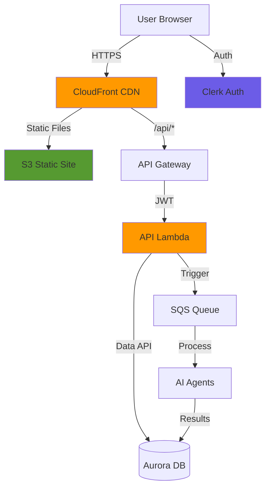

```mermaid
graph TB
    User[User Browser] -->|HTTPS| CF[CloudFront CDN]
    CF -->|Static Files| S3[S3 Static Site]
    CF -->|/api/*| APIG[API Gateway]

    User -->|Auth| Clerk[Clerk Auth]
    APIG -->|JWT| Lambda[API Lambda]

    Lambda -->|Data API| Aurora[(Aurora DB)]
    Lambda -->|Trigger| SQS[SQS Queue]

    SQS -->|Process| Agents[AI Agents]
    Agents -->|Results| Aurora

    style CF fill:#FF9900
    style S3 fill:#569A31
    style Lambda fill:#FF9900
    style Clerk fill:#6C5CE7
```

